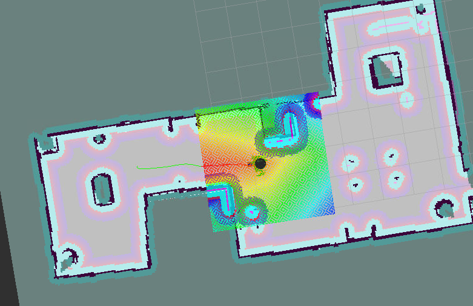
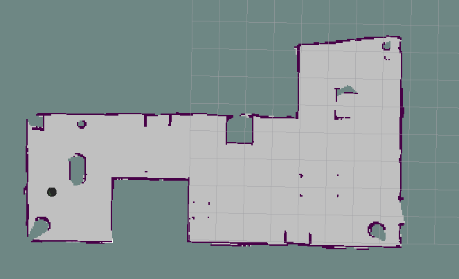
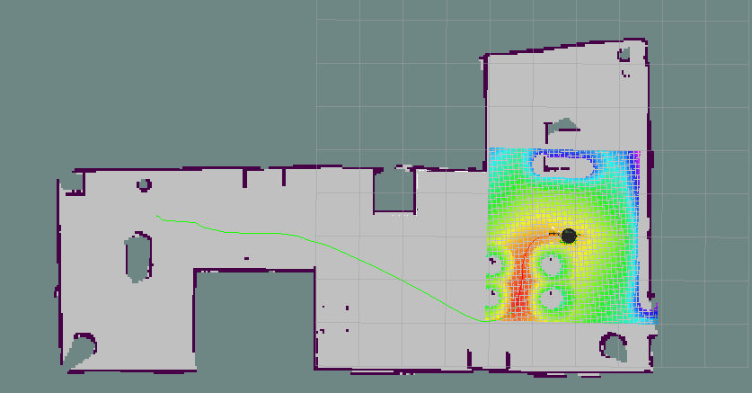
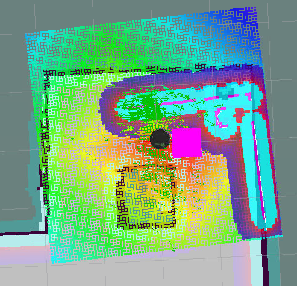

# Home Service Robot

This Project is the last project of the robotics engineering nano dedree from Udacity

<p align="center"></p>

## Project Goals

The goal of this project was to design a robot's environment in gazebo and program the home-service robot that will map it's environment and autonomously navigate to pre-specified pickup and drop-off locations. For this one needed to:

* Design a simulation environment in Gazebo
* Teleoperate the robot and manually test SLAM.
* Use the ROS navigation stack and manually command the robot using the 2D Nav Goal arrow in rviz to move to 2 different desired positions and orientations.
* Write a pick_objects node that commands the robot to move to the desired pickup and drop off zones.
* Write an add_markers node that subscribes to the robot odometry and publishes pick-up and drop-off markers to rviz.
* modify pick_objects node and add_markers node to establish communication between them, to complete desired home service robot implementation

## Simulation Set Up

As the project was developped inside the provided workspace by Udacity it might require extrat steps to be operational on an other set up.

- Go to the root directory.
- execute the following commands

```
mkdir -p ./catkin_ws/src
cd  /catkin_ws/src
catkin_init_workspace
cd .. 
catkin_make 

cd /catkin_ws/src
git clone https://github.com/ros-perception/slam_gmapping
git clone https://github.com/turtlebot/turtlebot
git clone https://github.com/turtlebot/turtlebot_interactions
git clone https://github.com/turtlebot/turtlebot_simulator

cd ..

source devel/setup.bash
rosdep -i install gmapping
rosdep -i install turtlebot_teleop
rosdep -i install turtlebot_rviz_launchers
rosdep -i install turtlebot_gazebo

catkin_make
source devel/setup.bash
```

## Source Directory Structure
```
catkin_ws/src
    ├── slam_gmapping                  # gmapping_demo.launch file                   
    │   ├── gmapping
    │   ├── ...
    ├── turtlebot                      # keyboard_teleop.launch file
    │   ├── turtlebot_teleop
    │   ├── ...
    ├── turtlebot_interactions         # view_navigation.launch file      
    │   ├── turtlebot_rviz_launchers
    │   ├── ...
    ├── turtlebot_simulator            # turtlebot_world.launch file 
    │   ├── turtlebot_gazebo
    │   ├── ...
    ├── World                          # world files
    │   ├── ...
    ├── ShellScripts                   # shell scripts files
    │   ├── ...
    ├──RvizConfig                      # rviz configuration files
    │   ├── ...
    ├──wall_follower                   # wall_follower C++ node
    │   ├── src/wall_follower.cpp
    │   ├── ...
    ├──pick_objects                    # pick_objects C++ node
    │   ├── src/pick_objects.cpp
    │   ├── ...
    ├──add_markers                     # add_marker C++ node
    │   ├── src/add_markers.cpp
    │   ├── ...
    └──
```
## Projects Steps

!! WARNING !!

**To Excecute the coming shell scripts you might have to modify files locations of the worlds and maps**

### SLAM Test and Mapping

In this section we use gmapping ROS package in ordre to generate a map of our simulation environment. This map will be useful later in this project to navigate the robot.

<p align="center"></p>

To start the mapping process and test if the Gazebo setup is working fine you should use the next commands:

```
cd /catkin_ws/src/scripts
. test_slam.sh
```

This will run the following launch files:

- `turtlebot_world.launch` turtlebot in my world in a desired pose
- `gmapping_demo.launch` launch SLAM package
- `view_navigation.launch` to observe map in rviz
- `keyboard_teleop.launch` teleoperate robot


### Localization and Navigation

In this section we will set goals for our robot to localize and navigate inside the environment, to set up goals we use the `2D Nav Goal` button available in rviz.

<p align="center"></p>

To start this step run the next commands:

```
cd /catkin_ws/src/scripts
. test_localization.sh
```

This will launch:

* `turtlebot_world.launch` to deploy turtlebot in my world in a desired pose
* `amcl_demo.launch` to localize turtlebot
* `view_navigation.launch` to observe map in rviz

### Navigation Goal Node

For this I create a ROS Package (`pick_objects`) containing a node which set up a pick up goal followed by drop off goal. A sleep function is used to simulate pick up and drop off time of the robot.

This package is launched later by the home service launch scripts.

To synchronize with other package a publisher send messages with the goal state on the `/goal_state` topic.

### Virtual Objects

The virtual objects are generated using an other custom ROS package (`add_markers`), this package display a colored square inside the map to visualize the goals location.

The required steps for this package is:
  - add the cube at the pickup location
  - remove the cube after the pick up and add it at 
  - add the cube once the drop off is performed

To synchronize with the `pick_objects` package this package subscribe to the `/goal_state` topic.

### Home Service Robot

<p align="center"></p>

This last step simulate a robot picking up a cube at a given location then navigate to the drop off location and drop the cube.

To excecute this final step use the commands:

```
cd /catkin_ws/src/scripts
. home_service.sh
```